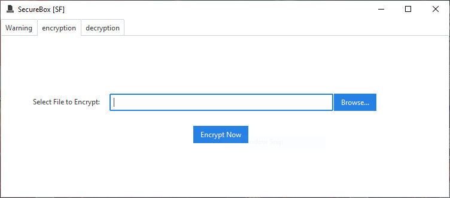

# 🔐 SecureBox [SF] – GUI File Encryption & Decryption Tool

SecureBox [SF] is a lightweight, user-friendly encryption and decryption tool built with Python and ttkbootstrap (Tkinter).  
It provides a clean graphical interface to securely encrypt and decrypt files using AES with a custom password, and features progress tracking, file validation, and user warnings for safety.

---

## ✨ Features

- 📁 Encrypt any file using AES with a custom password.
- 🔓 Decrypt `.SF` encrypted files securely.
- 🛑 Detects if a file is already encrypted.
- 📊 Real-time progress bar during operations.
- 🚫 Warns users not to close the app during encryption/decryption.
- 🔐 Displays a password prompt for both actions.
- 🌐 Multilingual warning (English & Arabic).
- 🪟 Custom icon for window and executable.
- 📦 Prepared for `.exe` conversion using PyInstaller with embedded icon.

---

## 📁 File Format

- Encrypted files are saved with `.SF` extension to distinguish them.
- Files not ending in `.SF` are treated as plaintext (for encryption).
- The program prevents redundant encryption of already encrypted files.

---

## 🛠️ Dependencies

- Python 3.10+
- `ttkbootstrap`
- `tkinter` (built-in)
- `Enc.py` module (must include `encryption()` and `decryption()` AES logic)

---

## 💡 Usage

### 🔐 Encrypt:
1. Select a file.
2. Enter a password.
3. File will be encrypted and saved as `.SF`.

### 🔓 Decrypt:
1. Select a `.SF` file.
2. Enter the correct password.
3. File will be decrypted to its original form.

---

## ⚠️ Warnings

- ❗ **Don't forget the password** – the file will be unrecoverable.
- ❗ **Do not close the app** during encryption/decryption to avoid corruption.

---

## 🖼️ Screenshot

---

